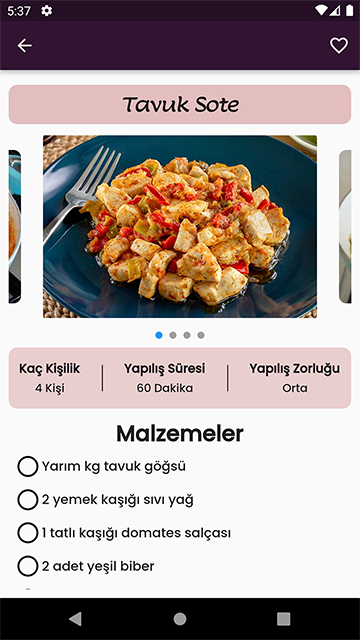
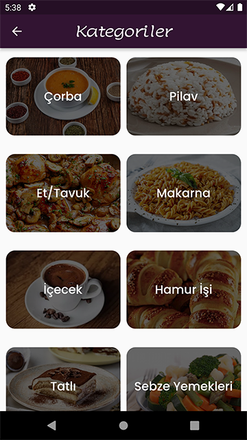

A Recipes App with Flutter 

Features: 
:heavy_check_mark: At home page , user sees classified recipes like the categories,simple recipes,short time recipes,classic recipes,recipes for multiple people,main course recipes,light meal recipes,drink recipes. 
 
:heavy_check_mark: When user clicks on recipe card its navigate to details screen,at there user sees recipe's name,some pictures of its,for how many person,make time and make diffuculty,ingredients and making steps of recipe. 
 
:heavy_check_mark: Recipes are categorized, recipes are displayed according to the relevant category clicked on the categories screen. 
 
:heavy_check_mark: The recipes is stored at the local database was created with SQLITE.(db file at "assets" folder.) 
 
:heavy_check_mark: User can add any recipe to his/her "favorites" 
 
:heavy_check_mark: User can search on recipes. 

Technologies: 
:pushpin: Flutter 
:pushpin: Dart 
:pushpin: SQLITE Database 
:pushpin: Important Packages : sqflite,flutter_native_splash,carousel_slider 

Home Screen 
 
Drawer Screen 
 
Details Screen 
 
Categories Screen 
 
 
Search Screen 
 

This project developed by [YusufUguz](https://github.com/YusufUguz) 

